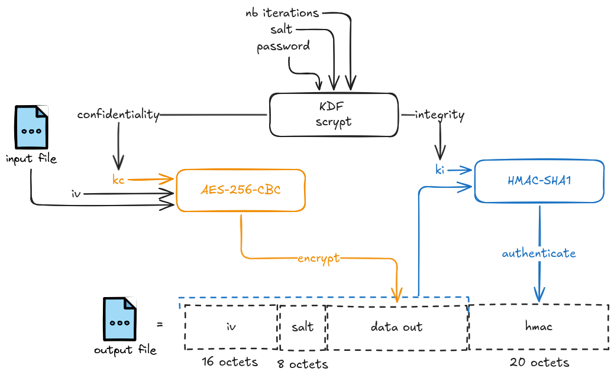

# Contexte
L'objectif de ce projet est de mettre en place une pipeline CI/CD intégrant des outils d'analyse de sécurité automatisés pour un outil de chiffrement et déchiffrement de fichiers.
## L'outil de chiffrement/déchiffrement
L'outil permet de chiffrer et déchiffrer des fichiers de manière symétrique. Il implémente :
- **Dérivation de clé** : la fonction `scrypt` (`KDF`) génère une clé maître à partir d'un mot de passe, d'un salt et d'un nombre d'itérations
- **Séparation des clés** : à partir de la clé maître, deux clés sont dérivées :
    - **`kc`** (clé de confidentialité) → utilisée pour le chiffrement `AES-256-CBC`
    - **`ki`** (clé d'intégrité) → utilisée pour le `HMAC`
- **Chiffrement** : `AES-256` en mode `CBC`
- **Intégrité** : `HMAC` pour garantir que le fichier n'a pas été modifié
## Schéma du script

## Vulnérabilités volontairement introduites
Pour tester les capacités de détection des outils de sécurité, plusieurs vulnérabilités ont été **intentionnellement** introduites dans le code :

| Vulnérabilité             | Description                          | Impact                                                               |
| ------------------------- | ------------------------------------ | -------------------------------------------------------------------- |
| mot de passe hardcodé     | `password = "chiffrementsymetrique"` | Mot de passe visible donc tout le monde peut déchiffrer les fichiers |
| `salt` hardcodé           | Valeur fixe au lieu d'aléatoire      | Même mot de passe = même clé dérivée                                 |
| `iv` hardcodé             | Valeur fixe au lieu d'aléatoire      | Même *plaintext* = même *ciphertext*                                 |
| `SHA1` pour `HMAC`        | Algorithme obsolète                  | Vulnérable aux attaques par collision                                |
| utilisation de `pyCrypto` | Librairie dépréciée depuis 2014      | `CVE-2013-7459`                                                      |
# La pipeline CI/CD
## Les outils
La pipeline CI/CD intègre 4 outils d'analyse de sécurité :

| Outil    | Type           | Rôle                              |
| -------- | -------------- | --------------------------------- |
| Gitleaks | Secret scanner | Détecte les secrets hardcodé      |
| Bandit   | SAST (Python)  | Analyse statique du code Python   |
| Safety   | SCA            | Analyse des dépendances du projet |
### Résultats attendus

| Outil    | Résultat attendu                                                            |
| -------- | --------------------------------------------------------------------------- |
| Gitleaks | Détecte le `password = "chiffrementsymetrique"`                             |
| Bandit   | Détecte le `password = "chiffrementsymetrique"` + utilisation de `pyCrypto` |
| Safety   | Détecte `CVE-2013-7459` dans `pyCrypto`                                     |
### Résultats obtenus

| Outil    | Résultat attendu                                                            |
| -------- | --------------------------------------------------------------------------- |
| Gitleaks | Ne détecte pas le `password = "chiffrementsymetrique"`                      |
| Bandit   | Détecte le `password = "chiffrementsymetrique"` + utilisation de `pyCrypto` |
| Safety   | Détecte `CVE-2013-7459` dans `pyCrypto`                                     |
### Analyse 
**<span style="background:rgba(3, 135, 102, 0.2)"><u>Points positifs :</u></span>**
- *Safety* détecte correctement la CVE dans `pyCrypto`
- *Bandit* détecte le mot de passe hardcodé et l'utilisation de `pyCrypto`

**<u><span style="background:rgba(163, 67, 31, 0.2)">Point négatif :</span></u>**
- *Gitleaks* ne détecte pas `password = "chiffrementsymetrique"`, possiblement car le format n'est pas reconnu
- *Bandit* ne détecte pas l'utilisation de `SHA1`
### Semgrep
Pour contrer les limitations des outils utilisés, j'ai décidé d'utiliser *Semgrep* et de crées des règles personnalisées :
```yaml
rules:
  - id: SHA1-detection
    message: "Utilisation de SHA1 détecté, algorithme faible"
    severity: WARNING
    languages: 
      - python
    patterns:
      - pattern-either:
        - pattern: SHA1
        - pattern: SHA1.new
        - pattern: from Crypto.Hash import SHA1

  - id: salt-detection
    message: "Salt hardcodé détecté"
    severity: WARNING
    languages: 
      - python
    pattern: salt = b'...'

  - id: iv-detection
    message: "IV hardcodé détecté"
    severity: WARNING
    languages: 
      - python
    pattern: iv = b'...'
```
Ces règles permettent de détecter :
- L'utilisation de `SHA1`
- L'utilisation de `MD5`
- Les `salt` hardcodés
- Les `IV` hardcodés
# Structure du projet
```
DevSecOpsLAB/
├── .github/
│   └── workflows/
│       └── security-pipeline.yml   # Pipeline CI/CD
├── src/
│   ├── protect_symetric.py         # Script de chiffrement
│   └── unprotect-symetric.py       # Script de déchiffrement
├── requirements.txt                # Dépendances du projet
├── semgrep-rules.yaml              # Règles Semgrep personnalisées
└── README.md
```
